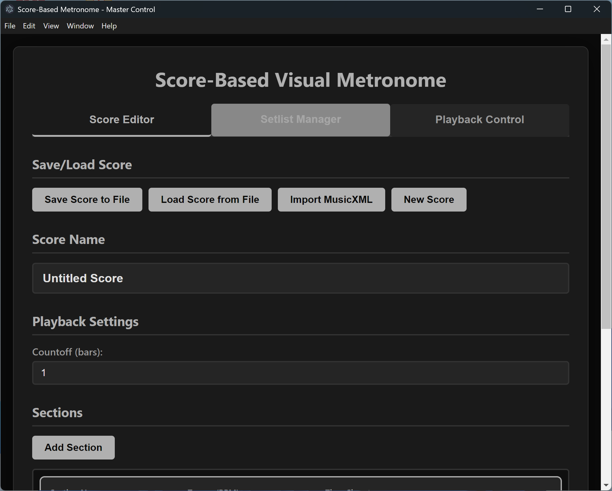
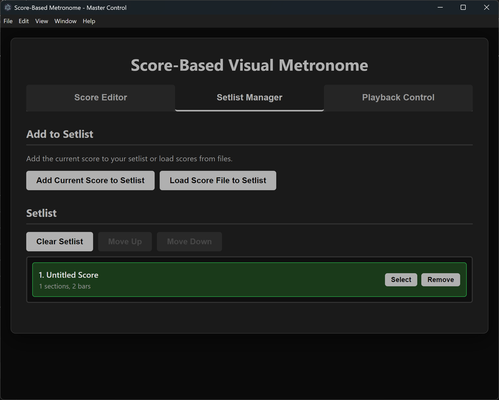
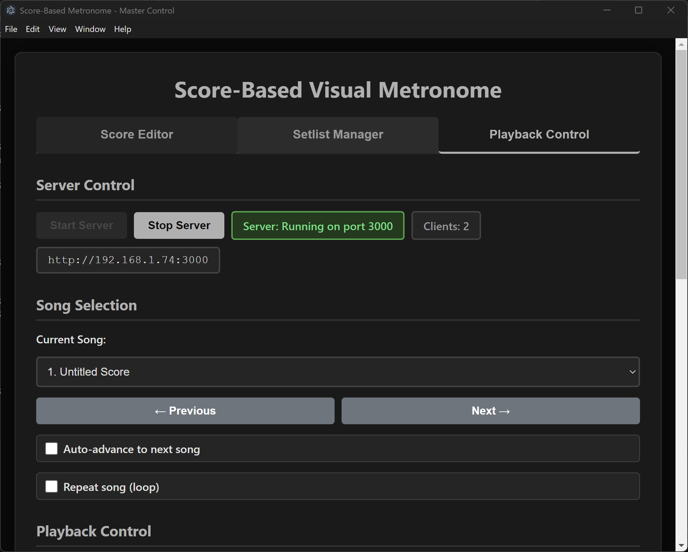
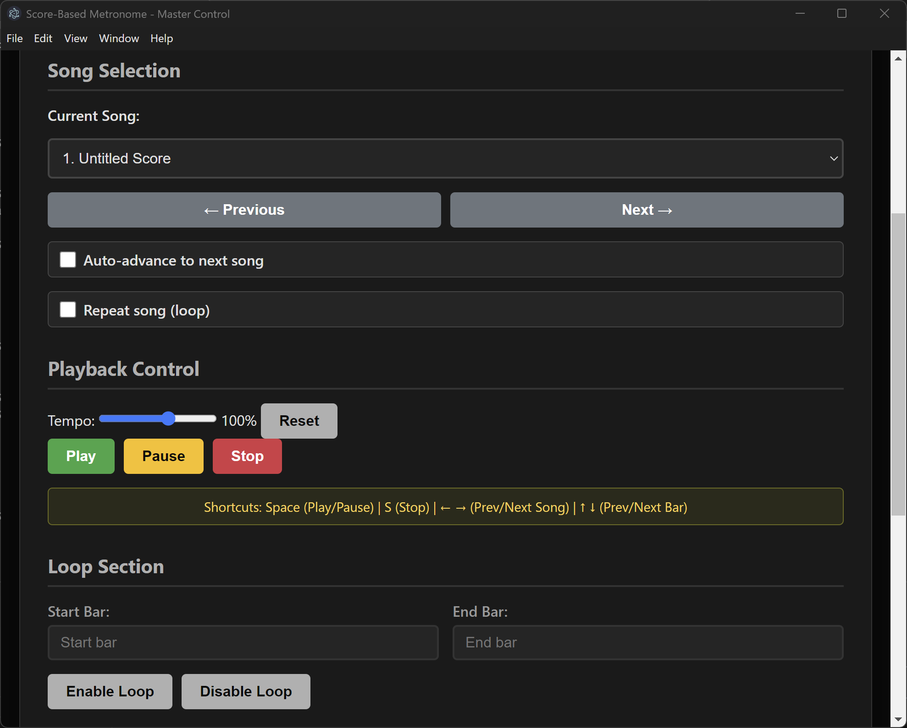
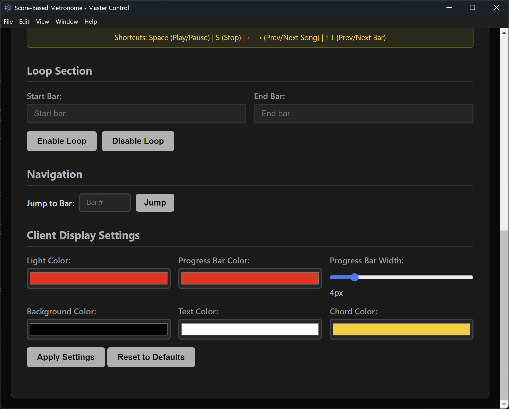

# Visual Metronome

A score-based visual metronome application with WebSocket synchronization for multiple clients. Perfect for bands, orchestras, and ensembles who need synchronized visual cues.

## Features

- **Score-based playback** - Define sections with different tempos and time signatures
- **Multi-client sync** - Connect multiple devices via WebSocket for synchronized visual display
- **Setlist management** - Create and manage setlists with multiple songs
- **Customizable display** - Configure colors for lights, progress bar, background, and text
- **Loop and navigation** - Loop sections, jump to specific bars, and navigate through songs

## Screenshots

### Score Editor



### Setlist Manager


### Playback Control



### Client Display Settings


## Installation

### From Executable
1. Download `Visual Metronome 1.0.0.exe` from the `dist` folder
2. Double-click to run (Windows may show a SmartScreen warning - click "More info" → "Run anyway")

### From Source
```bash
npm install
npm start
```

### Build Executable
```bash
npm run build
```

---

## User Manual

### Tab 1: Score Editor

#### Save/Load Score
- **Save Score to File** - Save the current score as a JSON file
- **Load Score from File** - Load a previously saved score
- **Import MusicXML** - Import scores from MusicXML format
- **New Score** - Create a blank score (clears current work)

#### Score Name
Enter a name for your score. This will be displayed on client devices during playback.

#### Playback Settings
- **Countoff (bars)** - Number of countoff bars before the song starts (0-4)

#### Sections
Each score consists of one or more sections. Each section has:
- **Section Name** - Label displayed on client devices (e.g., "Intro", "Verse", "Chorus")
- **Tempo** - BPM for this section
- **Time Signature** - Beats per bar and note value (e.g., 4/4, 3/4, 6/8)

##### Bars
Each section contains bars with:
- **Chords** - Optional chord symbols displayed on client devices
- **Redirect** - Jump to a specific bar number after this bar (for repeats/codas)
- **Advanced options** (click arrow to expand):
  - **Accent Pattern** - Select which beats to accent
  - **Subdivision** - Add subdivisions (8th notes, 16th notes, triplets, etc.)

##### Controls
- **Add Section** - Add a new section with one bar
- **Add Bar** - Add a bar to a section
- **Delete buttons (✕)** - Remove individual bars or sections

---

### Tab 2: Setlist Manager

#### Add to Setlist
- **Add Current Score to Setlist** - Add the score from the Score Editor
- **Load Score File to Setlist** - Load a saved score file directly to the setlist

#### Setlist
- Click a song to select it
- **Move Up/Down** - Reorder songs in the setlist
- **Clear Setlist** - Remove all songs
- **Remove** - Remove individual songs

---

### Tab 3: Playback Control

#### Server Control
- **Start Server** - Start the WebSocket server on port 3000
- **Stop Server** - Stop the server
- **Server URL** - Display the URL for clients to connect (e.g., `http://localhost:3000`)
- **Clients** - Number of connected client devices

#### Song Selection
- **Current Song** - Select which song from the setlist to play
- **Previous/Next** - Navigate between songs
- **Auto-advance to next song** - Automatically play the next song when current ends
  - **Pause between songs** - Seconds to wait before starting next song (0-30)
- **Repeat song (loop)** - Loop the current song continuously

#### Playback Control
- **Tempo slider** - Adjust playback speed (25% - 150%)
- **Play/Pause/Stop** - Control playback

##### Keyboard Shortcuts
| Key | Action |
|-----|--------|
| Space | Play/Pause |
| S | Stop |
| ← → | Previous/Next Song |
| ↑ ↓ | Previous/Next Bar |

#### Loop Section
Set start and end bars to loop a specific section of the song.

#### Navigation
Jump directly to a specific bar number.

#### Client Display Settings
Customize the appearance of client displays:
- **Light Color** - Color of the beat indicator lights
- **Progress Bar Color** - Color of the vertical progress bar
- **Progress Bar Width** - Width in pixels (2-20)
- **Background Color** - Client screen background
- **Text Color** - Bar numbers and other text
- **Chord Color** - Color of chord symbols

Click **Apply Settings** to send changes to connected clients.

---

## Client Display

### Connecting Clients
1. Start the server in Playback Control tab
2. On client devices, open a web browser
3. Navigate to the server URL (e.g., `http://192.168.1.100:3000`)
4. For local network access, use your computer's local IP address instead of `localhost`

### Display Elements
- **Song Name** - Current song title (top left, smaller)
- **Section Name** - Current section (top left, large)
- **Bar Number** - Current bar (top right, very large)
- **Chords** - Chord symbols (center)
- **Progress Bar** - Vertical line moving left to right with motion blur trail
- **Beat Lights** - One light per beat in the time signature
- **Time Signature & Tempo** - Displayed at bottom left

### Visual Cues
- **Countoff** - Displays "COUNTOFF" with bar number "0"
- **First beat flash** - Background briefly flashes on beat 1
- **Accented beats** - Brighter light and background flash
- **Subdivisions** - Smaller, dimmer light pulses

---

## File Formats

### Score Files (.json)
Scores are saved as JSON files containing:
- Score name
- Countoff setting
- Sections with tempo, time signature, and bars
- Loop settings

### MusicXML Import
The application can import basic MusicXML files, extracting:
- Song title
- Tempo changes (creates new sections)
- Time signature changes (creates new sections)
- Rehearsal marks (section names)
- Chord symbols

---

## Network Setup

### Local Network
To allow other devices on your network to connect:
1. Find your computer's local IP address (e.g., `192.168.1.100`)
2. Ensure port 3000 is allowed through your firewall
3. Clients connect to `http://YOUR_IP:3000`

### Finding Your IP Address
- **Windows**: Open Command Prompt, type `ipconfig`, look for "IPv4 Address"
- **Mac/Linux**: Open Terminal, type `ifconfig` or `ip addr`

---

## Tips

1. **Create sections for tempo/time signature changes** - Each section can have different settings
2. **Use redirects for repeat signs** - Set the redirect on the last bar of a section to jump back
3. **Test with one client first** - Verify everything works before connecting multiple devices
4. **Use fullscreen on clients** - Press F11 in the browser for best visibility
5. **Adjust tempo on the fly** - Use the tempo slider during rehearsal without editing the score

---

## Troubleshooting

### Clients can't connect
- Check that the server is running (green status)
- Verify firewall allows port 3000
- Use the correct IP address for network clients
- Ensure devices are on the same network

### Playback issues
- Check that the score has at least one bar
- Verify the setlist has songs if using setlist mode
- Try stopping and restarting the server

### Display not updating
- Refresh the client browser page
- Check the connection status indicator
- Restart the server

---

## License

ISC License
