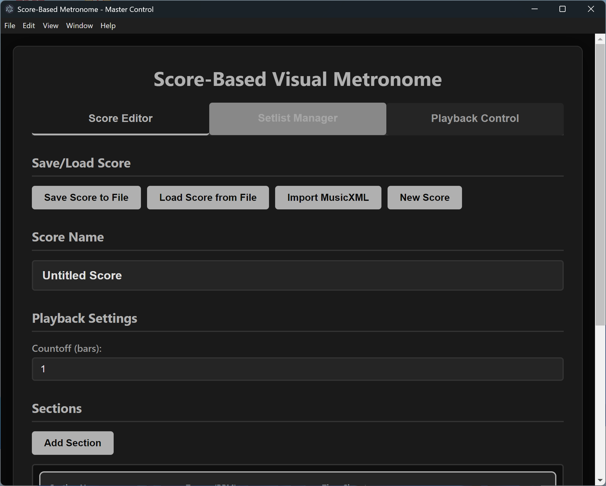
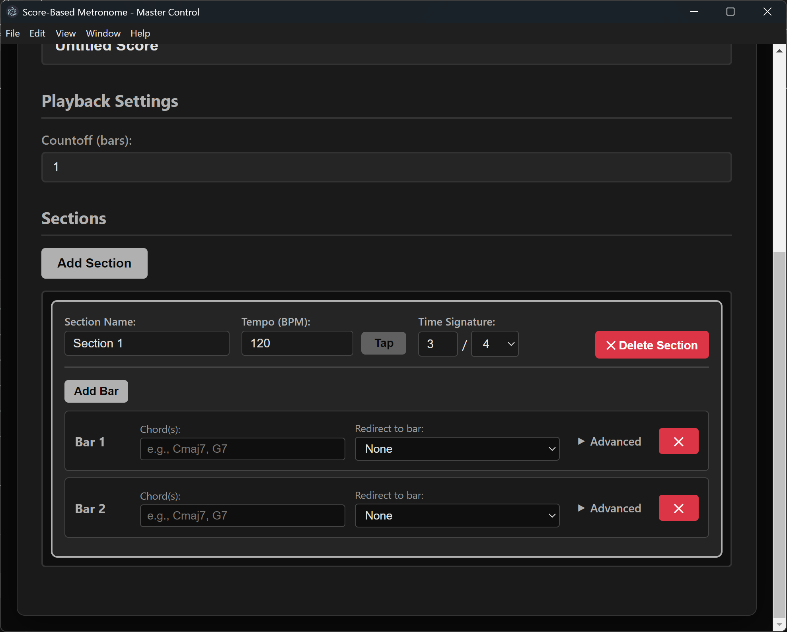
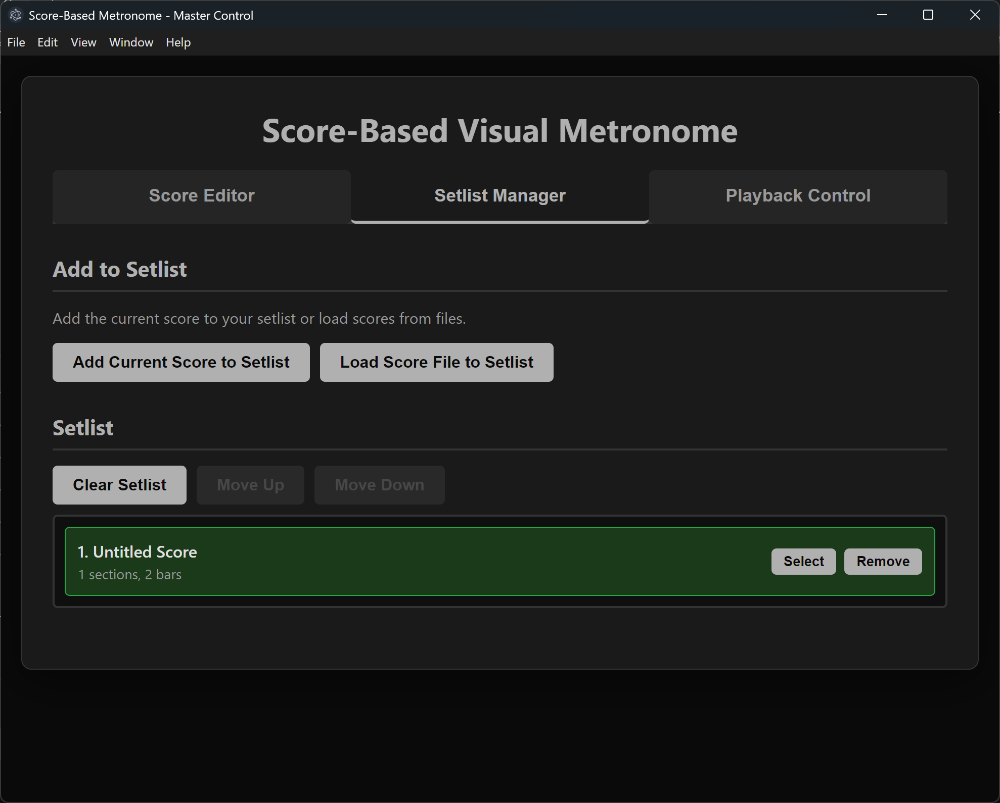
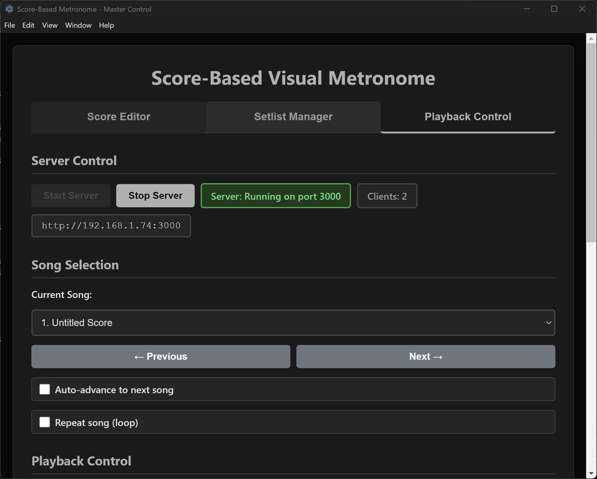
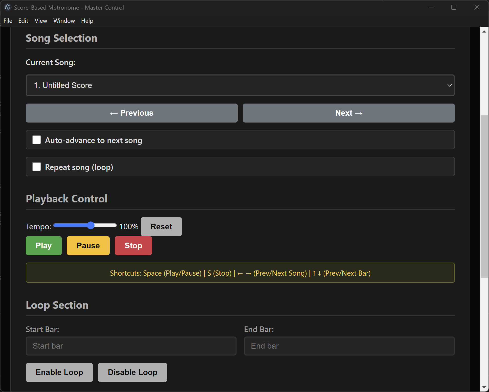
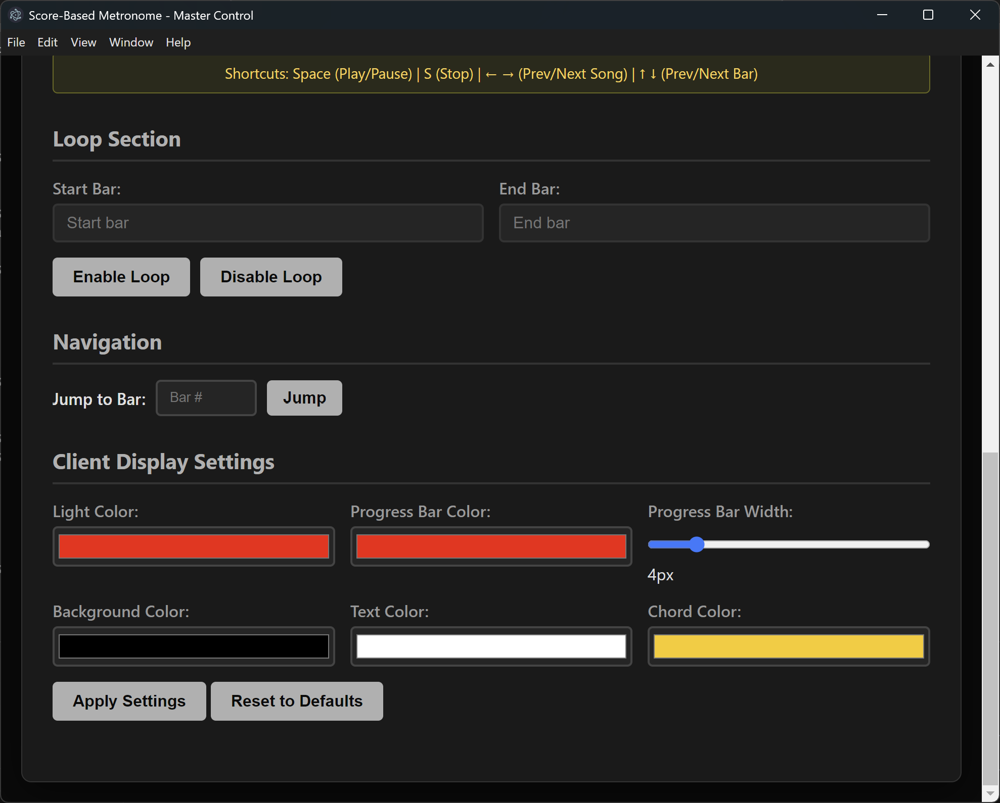
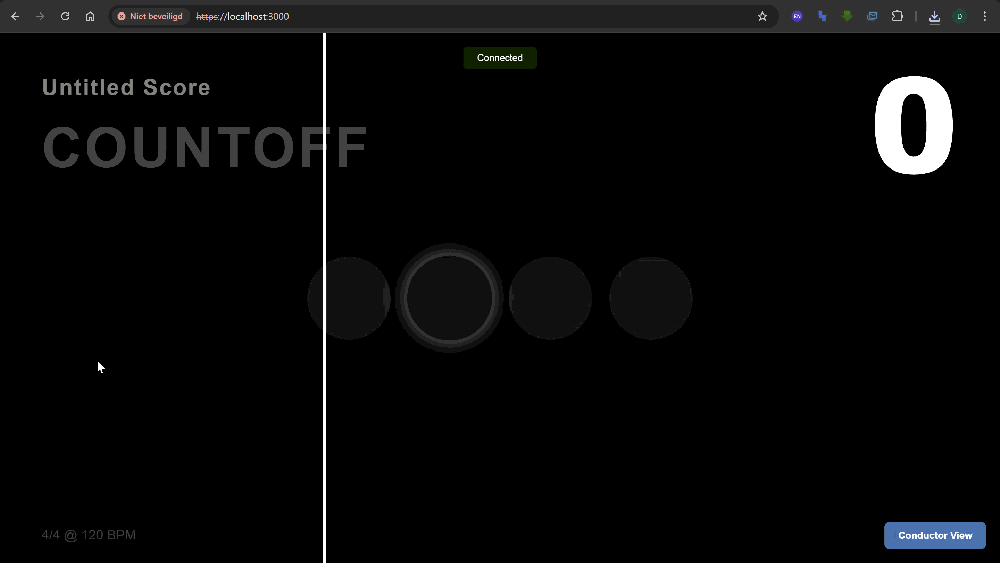

# Visual Metronome

A professional score-based visual metronome application with WebSocket synchronization for multiple clients. Perfect for bands, orchestras, and ensembles who need synchronized visual cues with advanced musical notation support.

## Features

### Core Features
- **Score-based playback** - Define sections with different tempos and time signatures
- **Multi-client sync** - Connect multiple devices via WebSocket for synchronized visual display
- **Setlist management** - Create, save, and load setlists with multiple songs
- **Customizable display** - Configure colors for lights, progress bar, background, flash, and text
- **Advanced navigation** - Multiple jump modes, bar-level precision control

### Musical Notation Support
- **Repeat/Volta brackets** - First, second, third endings with automatic repeat counting
- **Dal Segno (D.S.)** - Jump back to Segno marker (𝄋)
- **Da Capo (D.C.)** - Jump back to the beginning
- **Coda markers** - Jump to Coda section (⊕) after D.S./D.C.
- **Fine markers** - End piece at Fine marker after D.S./D.C.
- **Fermata bars** - Hold bars for specific durations (beats or seconds)

### Advanced Features
- **Conductor view** - Dedicated password-protected control interface for live performance
- **Vamps with safety bars** - Define repeating sections with conductor-triggered exits
- **Synchronized click track** - Audio metronome clicks on all client devices with per-client delay adjustment
- **Video background** - Stream video backgrounds that sync with playback for visual performances
- **Beat-level display** - Show current beat within bar (e.g., "5|3" for beat 3 in bar 5)
- **Runtime display** - Show elapsed time from start of song in hh:mm:ss.ff format
- **Gradual tempo transitions** - Smooth tempo changes over specified bars
- **Manual sync control** - Fine-tune timing with millisecond and beat-level adjustments
- **Loop current bar** - Practice tool to repeat single bar indefinitely
- **Jump modes** - Direct, next beat, or after bar completion
- **OSC support** - Send OSC messages to trigger external applications
- **MIDI clock output** - Sync DAWs and hardware with tempo-accurate MIDI clock
- **Network detection** - Automatic detection of network issues and firewall problems
- **Comprehensive tooltips** - Helpful guidance on every control element throughout the GUI

## Screenshots

### Score Editor



### Setlist Manager


### Playback Control



### Client Display Settings


### Client Display


### Conductor View


## Installation

### From Releases
1. Download the latest release from the [Releases](https://github.com/dionzand/visual-metronome/releases) page
2. Extract and run the executable (Windows may show a SmartScreen warning - click "More info" → "Run anyway")

### From Source
```bash
npm install
npm start
```

### Build Executable
```bash
npm run build
```

---

## User Manual

### Tab 1: Score Editor

#### Save/Load Score
- **Save Score to File** - Save the current score as a JSON file
- **Load Score from File** - Load a previously saved score
- **Import MusicXML** - Import scores from MusicXML format
- **New Score** - Create a blank score (clears current work)

#### Score Name
Enter a name for your score. This will be displayed on client devices during playback.

#### Video Background
- **Video File Path** - Full path to a video file to display as background on all clients (e.g., `C:\Videos\background.mp4`)
- **Video Opacity** - Transparency of the video background (0-100%, default: 30%)

The video will:
- Stream from the Electron app to all connected clients
- Start/pause/stop in sync with score playback
- Support multiple formats: MP4, WebM, OGG, MOV, AVI, MKV
- Display at the specified opacity behind all UI elements
- Reset to beginning when playback is stopped

**Use cases:**
- Sync to music videos or conductor recordings
- Display choreography videos for dance performances
- Show visual cues or backing visuals

#### Playback Settings
- **Countoff (bars)** - Number of countoff bars before the song starts (0-4)

#### Sections
Each score consists of one or more sections. Each section has:
- **Section Name** - Label displayed on client devices (e.g., "Intro", "Verse", "Chorus")
- **Tempo** - BPM for this section
- **Tempo Transition (bars)** - Number of bars in *previous* section to gradually transition tempo (0-32)
- **Time Signature** - Beats per bar and note value (e.g., 4/4, 3/4, 6/8)

##### Bars
Each section contains bars with:
- **Chords** - Optional chord symbols displayed on client devices
- **Redirect to bar** - Jump to a specific bar number after this bar
- **Times to redirect** - How many times to take the redirect before continuing
- **Advanced options** (click arrow to expand):
  - **Fermata bar** - Hold this bar for a specific duration (beats or seconds)
  - **Accent Pattern** - Select which beats to accent (stronger visual flash)
  - **Subdivision** - Add subdivisions (8th notes, 16th notes, triplets, quintuplets, sextuplets)
  - **Repeat/Volta Markers**:
    - **Start Repeat |:** - Marks beginning of repeat section
    - **End Repeat :|** - Marks end of repeat, jumps back to start repeat
    - **Ending #** - Volta bracket numbers (e.g., "1,2" for first and second endings)
  - **Navigation Markers**:
    - **Segno 𝄋** - Target for Dal Segno jumps
    - **Coda ⊕** - Target for "To Coda" jumps
    - **D.S. (Dal Segno)** - Jump back to Segno marker
    - **D.C. (Da Capo)** - Jump back to beginning
    - **To Coda →⊕** - Jump to Coda (active after D.S./D.C.)
    - **Fine (end)** - End piece (active after D.S./D.C.)
  - **OSC Trigger** - Send an OSC message when this bar starts (address and arguments)

##### Controls
- **Add Section** - Add a new section with one bar
- **Add Bar** - Add a bar to a section
- **Delete buttons (✕)** - Remove individual bars or sections

#### Vamps
Define predefined vamps (repeating sections) that can be quickly activated during live performance.

- **Vamp Name** - Descriptive label (e.g., "Solo Section", "Outro Vamp")
- **Start Bar** - First bar of the vamp loop
- **End Bar** - Last bar of the vamp loop
- **Safety Bars** - Number of extra times to play the end bar after conductor signals exit

Vamps appear in:
- Playback Control tab for quick activation
- Conductor view for live control

When a vamp is active, playback loops between start and end bars. The conductor can add safety bars by clicking "Add Safety Bar" to signal musicians that the vamp is ending soon.

---

### Tab 2: Setlist Manager

#### Add to Setlist
- **Add Current Score to Setlist** - Add the score from the Score Editor
- **Load Score File to Setlist** - Load a saved score file directly to the setlist

#### Setlist
- Click a song to select it
- **Save Setlist** - Save the entire setlist to a file
- **Load Setlist** - Load a previously saved setlist
- **Move Up/Down** - Reorder songs in the setlist
- **Clear Setlist** - Remove all songs
- **Remove** - Remove individual songs

---

### Tab 3: Playback Control

#### Server Control
- **Port** - Configure the HTTPS server port (default: 3000, range: 1024-65535)
- **Conductor Password** - Set a 4-digit password to protect the conductor view (default: 1234)
- **Start Server** - Start the secure WebSocket server (HTTPS/WSS)
- **Stop Server** - Stop the server
- **Server URL** - Display the HTTPS URL for clients to connect (e.g., `https://192.168.1.100:3000`)
- **Clients** - Number of connected client devices

**Note:** The server automatically tries to start an HTTP→HTTPS redirect on port 80 or 8080 for convenience. If you type just the hostname/IP without `https://`, you may be automatically redirected to the secure connection.

#### Song Selection
- **Current Song** - Select which song from the setlist to play
- **Previous/Next** - Navigate between songs
- **Auto-advance to next song** - Automatically play the next song when current ends
  - **Pause between songs** - Seconds to wait before starting next song (0-30)
- **Repeat song (loop)** - Loop the current song continuously

#### Playback Control
- **Tempo slider** - Adjust playback speed (25% - 150%)
- **Play/Pause/Stop** - Control playback
- **Loop Current Bar** - Toggle to repeat the current bar indefinitely (practice tool)

##### Keyboard Shortcuts
| Key | Action |
|-----|--------|
| Space | Play/Pause |
| S | Stop |
| ← → | Previous/Next Song |
| ↑ ↓ | Previous/Next Bar |
| L | Loop Current Bar |

#### Click Track Settings
Synchronized audio click track that plays on all connected client devices.

- **Enable Click Track** - Turn on/off the click track for all clients
- **Volume** - Server-side volume control (0-100%)

##### Client-Side Controls
Each client can individually adjust:
- **Volume** - Local click volume (does not affect other clients)
- **Delay** - Fine-tune timing to compensate for network/audio latency (delay-only, positive values)
  - **+1ms** - Add 1 millisecond of delay
  - **0ms** - Reset delay to zero

The click track features:
- **Accent pattern** - First beat and accented beats use a higher-pitched click
- **Subdivisions** - Supports 8th notes, 16th notes, triplets, quintuplets, and sextuplets
- **Synchronized playback** - All clients play the same click in perfect sync
- **Manual delay adjustment** - Each client can delay their click to match slower devices or compensate for audio processing delay

#### Loop Section
Set start and end bars to loop a specific section of the song.

#### Vamps
Quick access to predefined vamps from the current score. Click any vamp to activate it immediately.

- Displays all vamps defined in the Score Editor
- Shows start/end bars and safety bar count
- Click to enable the vamp during playback
- Use "Add Safety Bar" in conductor view to signal vamp exit

#### Navigation
Jump to a specific bar number with three modes:
- **Jump directly (immediate)** - Interrupts current bar immediately
- **Jump at next beat** - Waits for next beat boundary
- **Jump after this bar** - Completes current bar before jumping

#### Manual Sync
Fine-tune playback timing to sync with external audio:
- **±50ms / ±10ms** - Adjust timing in milliseconds
- **← Beat Back / Beat Forward →** - Shift by one beat
- **Current Offset** - Display shows accumulated timing adjustment
- **Reset Offset** - Return to zero offset

#### Client Display Settings
Customize the appearance of client displays:
- **Light Color** - Color of the beat indicator lights
- **Progress Bar Color** - Color of the vertical progress bar
- **Progress Bar Width** - Width in pixels (2-50)
- **Background Color** - Client screen background
- **Background Flash Color** - Color for beat 1 and accent flashes
- **Text Color** - Bar numbers and other text
- **Chord Color** - Color of chord symbols

Click **Apply Settings** to send changes to connected clients.
Click **Reset to Defaults** to restore default color scheme.

#### OSC Settings
Send OSC (Open Sound Control) messages to external applications when specific bars are reached.

- **Enable OSC** - Turn OSC output on/off
- **Target IP** - IP address of the OSC receiver (default: 127.0.0.1)
- **Target Port** - Port number (default: 8000)
- **Test OSC Connection** - Send a test message to verify connection

##### Per-Bar OSC Triggers
In the Score Editor, expand a bar's "Advanced" options to configure:
- **OSC Address** - The OSC path to send (e.g., `/trigger/play`, `/backing/start`)
- **Arguments** - Comma-separated values (e.g., `1, start, 0.5`)

When playback reaches that bar, the OSC message is sent automatically.

**Example use cases:**
- Start a backing track at bar 1
- Trigger lighting cues at specific bars
- Send commands to QLab, Ableton Live, or other OSC-compatible software

#### MIDI Clock Output
Sync external DAWs and hardware devices with MIDI clock.

- **Enable MIDI Clock** - Turn MIDI clock output on/off
- **MIDI Output** - Select your MIDI output device
- **Refresh (↻)** - Refresh the list of MIDI ports

##### MIDI Messages Sent
| Event | MIDI Message |
|-------|--------------|
| Play | Start (0xFA) |
| Pause/Stop | Stop (0xFC) |
| Resume | Continue (0xFB) |
| During playback | Clock pulses (0xF8) at 24 PPQN |

**Setup with virtual MIDI (Windows):**
1. Install [loopMIDI](https://www.tobias-erichsen.de/software/loopmidi.html)
2. Create a virtual MIDI port
3. Select it in Visual Metronome
4. In your DAW, set the same port as MIDI clock input

---

## Client Display

### Connecting Clients
1. Start the server in Playback Control tab
2. On client devices, open a web browser
3. Navigate to the server URL displayed in the app (e.g., `https://192.168.1.100:3000`)
   - **Important:** Always use `https://` (not `http://`) when typing the URL with port number
   - If you type just the IP/hostname without port, HTTP redirect may automatically redirect you to HTTPS
4. For local network access, use your computer's local IP address instead of `localhost`

**Important - Certificate Warning:**
The server uses HTTPS with a self-signed certificate for secure WebSocket connections (required for iOS/Safari). When first connecting, you'll see a security warning:

- **Safari (iOS/Mac)**: Tap "Show Details" → "visit this website" → "Visit Website"
- **Chrome**: Click "Advanced" → "Proceed to [IP address] (unsafe)"
- **Firefox**: Click "Advanced" → "Accept the Risk and Continue"

This is normal and safe for local network use. The certificate ensures reliable WebSocket connections on all devices.

### Display Elements
- **Song Name** - Current song title (top left, smaller)
- **Section Name** - Current section (top left, large)
- **Bar Number with Beat** - Current bar and beat (top right, very large) - Format: "5|3" for beat 3 in bar 5
- **Beat Lights** - One light per beat in the time signature (center of screen)
- **Chords** - Chord symbols (bottom center)
- **Progress Bar** - Vertical line moving left to right
- **Runtime** - Elapsed time from song start in hh:mm:ss.ff format (bottom left, above time signature)
- **Time Signature & Tempo** - Displayed at bottom left
- **Tempo Change Indicator** - Shows "↗ Tempo Rising" or "↘ Tempo Falling" during transitions
- **Video Background** - Optional video that plays in sync with the score (configurable opacity)

### Visual Cues
- **Countoff** - Displays "COUNTOFF" with bar number "0"
- **First beat flash** - Background briefly flashes on beat 1
- **Accented beats** - Brighter light and stronger background flash
- **Subdivisions** - Smaller, dimmer light pulses between main beats
- **Fermata** - Large fermata symbol (𝄐) replaces beat lights during hold

---

## Conductor View

The conductor view provides a dedicated control interface for live performance, accessible at `https://[server-ip]:[port]/conductor-login`.

### Authentication
- Protected by a 4-digit password configured in Server Control
- Password required on first access
- Session persists for 30 minutes
- Sessions cleared when server restarts

### Features

#### Playback Controls
- **Play/Pause/Stop** - Control playback
- **Bar Display** - Large current bar number
- **Beat Lights** - Visual beat indicators matching client displays
- **Section & Song Info** - Current section and song name

#### Song Navigation
- **Song Selector** - Jump to any song in the setlist
- **Previous/Next Song** - Navigate through setlist
- **Bar Navigation** - Jump to specific bar numbers

#### Tempo Control
- **+5 / -5 BPM** - Adjust tempo in real-time
- **Reset Tempo** - Return to original tempo
- **Current Tempo Display** - Shows active tempo with transition indicator

#### Vamp Control
- **Predefined Vamps** - Quick access to all defined vamps
- **Enable Vamp** - Activate a vamp loop
- **Add Safety Bar** - Signal musicians that vamp is ending
- **Disable Vamp** - Exit vamp immediately
- **Safety Bar Counter** - Shows remaining safety bars

### Access URLs
- **Musician View:** `https://[server-ip]:[port]` (no password)
- **Conductor View:** `https://[server-ip]:[port]/conductor-login` (password required)

---

## File Formats

### Score Files (.json)
Scores are saved as JSON files containing:
- Score name
- Countoff setting
- Sections with tempo, time signature, and bars
- Loop settings
- Video background path and opacity settings

### MusicXML Import
The application can import basic MusicXML files, extracting:
- Song title
- Tempo changes (creates new sections)
- Time signature changes (creates new sections)
- Rehearsal marks (section names)
- Chord symbols

---

## Musical Notation Examples

### Repeat with First and Second Endings
```
Bar 1: Start Repeat |:
Bar 2-4: Main section
Bar 5: Ending # = "1" (first ending only)
Bar 6: Ending # = "2" (second ending only)
Bar 7: End Repeat :|

Result: 1→2→3→4→5→7(jump)→1→2→3→4→6→7(continue)
```

### D.S. al Coda (most common)
```
Bar 1-2: Intro
Bar 3: Segno 𝄋
Bar 4-8: Main section
Bar 6: To Coda →⊕ (skipped on first pass)
Bar 9: D.S.
Bar 10: Coda ⊕
Bar 11-12: Ending

Result: 1→2→3→4→5→6→7→8→9(jump to 3)→3→4→5→6(jump to 10)→10→11→12
```

### D.C. al Fine
```
Bar 1-8: Main section
Bar 5: Fine (ignored first time)
Bar 9: D.C.

Result: 1→2→3→4→5→6→7→8→9(jump to 1)→1→2→3→4→5(STOP)
```

### Multiple Ending Numbers
```
Bar 1: Start Repeat |:
Bar 2: (plays every time)
Bar 3: End Repeat :| + Ending # = "1,2"
Bar 4: Ending # = "3"

Result: 1→2→3(jump)→1→2→3(jump)→1→2→4(continue)
Automatically repeats 3 times based on highest volta number.
```

### Gradual Tempo Transition
```
Section 1: Tempo 120 BPM, 8 bars
Section 2: Tempo 140 BPM, Tempo Transition = 4 bars

Result: Last 4 bars of Section 1 gradually speed up from 120→140
Tempo changes smoothly: 125, 130, 135, 140 BPM
```

---

## Network Setup

### Local Network
To allow other devices on your network to connect:
1. Find your computer's local IP address (e.g., `192.168.1.100`)
2. Ensure the port (default: 3000) is allowed through your firewall
3. Clients connect to `https://YOUR_IP:PORT` (e.g., `https://192.168.1.100:3000`)
4. Accept the security certificate warning on first connection (see Client Display section)

### Network Detection & Warnings
The application automatically detects your network configuration and will warn you about potential connectivity issues:

- **Public Network Client Isolation** - If you're on a public WiFi network (coffee shop, airport, etc.), the app will detect that client isolation may be enabled, which blocks device-to-device communication.
  - **Solution 1**: Create a WiFi Hotspot from your computer (Settings → Network & Internet → Mobile hotspot)
  - **Solution 2**: Change network profile to Private (Settings → Network & Internet → Wi-Fi → Network profile)
  - **Solution 3**: Use a home/office router instead of public WiFi

- **Firewall Warnings** - If the app cannot verify the server is reachable from the network, it will suggest checking Windows Firewall settings or trying alternative ports (3001, 8080, 8000).

- **Port Fallback** - If the selected port is unavailable, the app automatically tries alternative ports and notifies you of the change.

### Finding Your IP Address
- **Windows**: Open Command Prompt, type `ipconfig`, look for "IPv4 Address"
- **Mac/Linux**: Open Terminal, type `ifconfig` or `ip addr`

---

## Tips

1. **Use proper notation markers** - Prefer repeat/volta brackets and D.S./D.C. markers over basic redirects for standard patterns
2. **Gradual tempo transitions** - Set transition bars when sections have tempo changes for smooth acceleration/deceleration
3. **Multiple ending numbers** - Use comma-separated values (e.g., "1,2") for bars that appear in multiple passes
4. **Manual sync** - Use beat-level adjustments first, then fine-tune with millisecond buttons
5. **Loop current bar** - Great for practicing difficult rhythms or syncing with external audio
6. **Test with one client first** - Verify everything works before connecting multiple devices
7. **Use fullscreen on clients** - Press F11 in the browser for best visibility
8. **Jump modes** - Use "after bar" mode during live performance to avoid interrupting the flow

---

## Troubleshooting

### Clients can't connect
- Check that the server is running (green status)
- Verify firewall allows port 3000
- Use the correct IP address for network clients
- Ensure devices are on the same network

### Playback issues
- Check that the score has at least one bar
- Verify the setlist has songs if using setlist mode
- Try stopping and restarting the server

### Display not updating
- Refresh the client browser page
- Check the connection status indicator
- Restart the server

---

## License

ISC License
